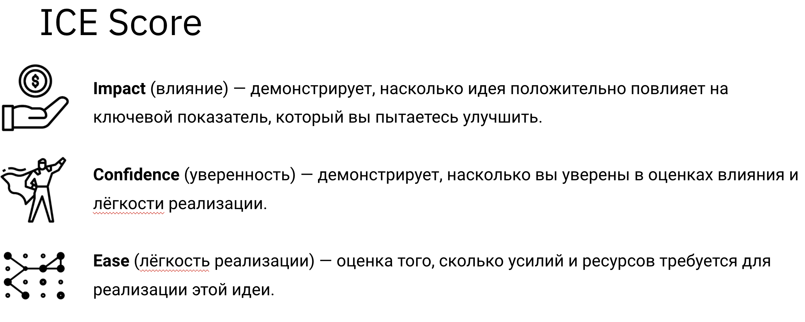

# Урок 2

## Метрики

- Кол-во посетителей сделавших заказ  
- Окупаемость рекламы(увеличилась ли посещаемость сайта и конверсия в заказ)

## Гипотезы

1. Если добавить возможность оформления заказов без регистрации, то конверсия в заказ повысится  
2. Если добавить кнопку 'К сравнению', то увеличится конверсия в заказ  
3. Если выделить кнопку 'Реферал', более ярким цветом, то увеличится число пользователей пришедших по реферальной программе  
4. Если на главной странице отображать товары со средней популярность, то увеличитса заказы этих товаров  
5. Если добавить быстрый доступ к популярным категориям, то увеличится конверсия в заказ

|Гипотеза|Impact|Confidence|Ease|ICE Score|
|---|:---:|:---:|:---:|:---:|
Гипотеза 1|8|8|7|448
Гипотеза 2|3|7|5|105
Гипотеза 3|6|5|9|270
Гипотеза 4|5|4|4|80
Гипотеза 5|2|2|7|28

## Дизайн

### Гипотеза

> Если добавить возможность оформления заказов в корзине без регистрации, то конверсия в заказ повысится.

### Что делаем

Контрольная версия:

- Оставляем текущий вариант: заказ только после регистрации.  

Тестовая версия:

- Даем возможность заказать товар по предоставлении только номера телефона, но с 100% предоплатой.

### На каких пользователях тестируем

- только на новых пользователях.

### Влияет на метрики

- Процент конверсий в заявку (%CR) — primary.  
- Процент показателя отказов — secondary.

### План действий

- Если наш эксперимент будет положительным, и мы зафиксируем ожидаемое улучшение в ключевых метриках и не посадим добавочные, то масштабируем изменение и «выкатываем» его на всех пользователей.  
- Если основные метрики падают или растут недостаточно либо добавочные метрики падают, откатываем эксперимент.
