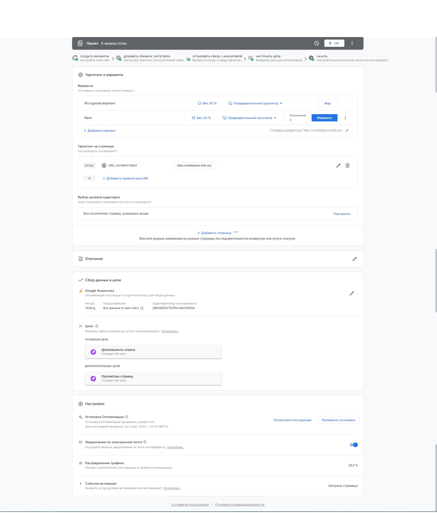

# Урок 3

## Шаблон

### Гипотеза

Если заменить изображение

На

И увеличить и изменить цвет кнопки

На

то увеличится длительность просмотра, и кол-во повторных заходов на страницу  

### Что делаем

Контрольная версия:

- Оставляем текущий вариант.

Тестовая версия:

- Изменяем изображение и цвет, размер кнопки.

### На каких пользователях тестируем

- на всех пользователях.

### Влияет на метрики

- Длительность просмотра страницы.  
- Кол-во повторных заходов.

### План действий

- Если наш эксперимент будет положительным, и мы зафиксируем ожидаемое улучшение в ключевых метриках и не посадим добавочные, то масштабируем изменение и «выкатываем» его на всех пользователей.  
- Если основные метрики падают или растут недостаточно либо добавочные метрики падают, откатываем эксперимент.

## Скришоты

### Настройка эксперимента

### Запуск

### Работа

### Отчет

